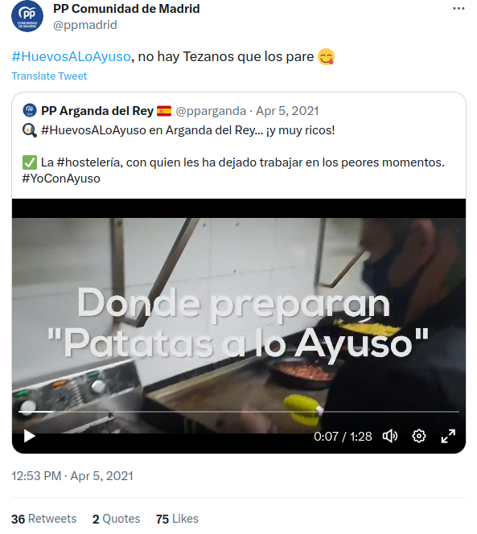
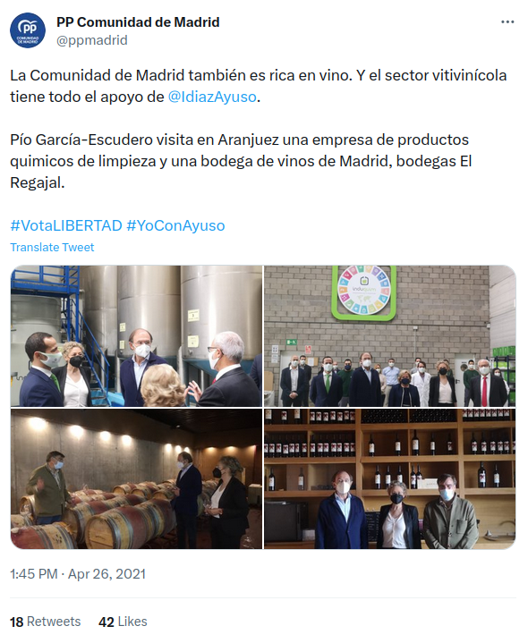
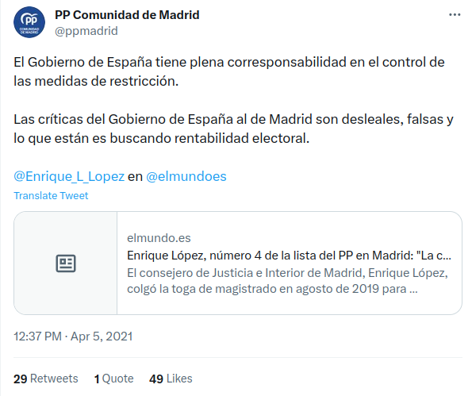
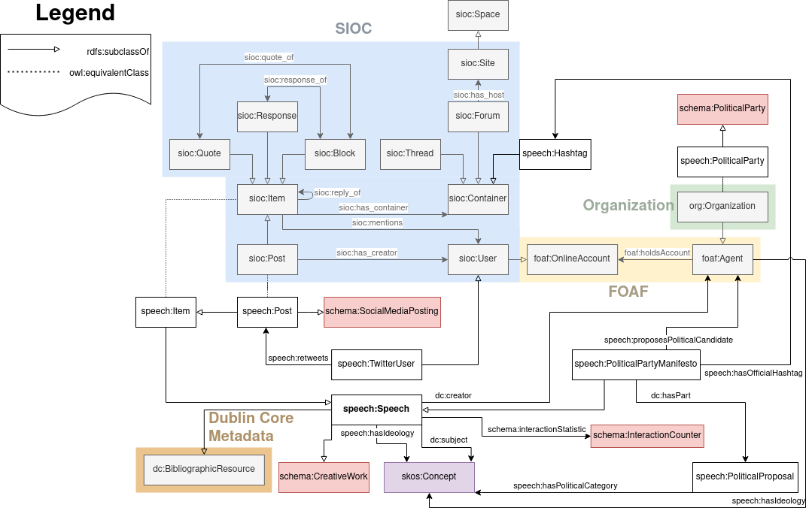

# Kick-Off documentation

## Estructura de los datos

### Para los tweets

<details>
  <summary>Ejemplo 1</summary>



```json
{
    "tweet_id": "1379024369574363139",
    "tweet_url": "https:\/\/twitter.com\/ppmadrid\/status\/1379024369574363139",
    "username": "ppmadrid",
    "name": "PP Comunidad de Madrid",
    "profile_picture": "https:\/\/pbs.twimg.com\/profile_images\/1589390008389099521\/gLWMNjrk_normal.jpg",
    "replies": 4.0,
    "views": null,
    "retweets": 36,
    "likes": 75,
    "quotes": 2,
    "bookmarks": 0,
    "posted_time": "2021-04-05T10:51:27+00:00",
    "content": "#HuevosALoAyuso, no hay Tezanos que los pare ",
    "hashtags": [
        "HuevosALoAyuso"
    ],
    "mentions": [],
    "images": [],
    "videos": [
        "blob:https:\/\/twitter.com\/5816da6e-c9e6-4954-85aa-6b86b499aed9"
    ],
    "link": "",
    "replies_relation_target_id": "",
    "replies_relation_target_url": "",
    "quotes_relation_target_id": "1379023875292430336",
    "quotes_relation_target_url": "https:\/\/twitter.com\/pparganda\/status\/1379023875292430336"
}
```
</details>

<details>
  <summary>Ejemplo 2</summary>


```json
{
    "tweet_id": "1386791731417567234",
    "tweet_url": "https:\/\/twitter.com\/ppmadrid\/status\/1386791731417567234",
    "username": "ppmadrid",
    "name": "PP Comunidad de Madrid",
    "profile_picture": "https:\/\/pbs.twimg.com\/profile_images\/1589390008389099521\/gLWMNjrk_normal.jpg",
    "replies": 2.0,
    "views": null,
    "retweets": 19,
    "likes": 41,
    "quotes": 2,
    "bookmarks": 0,
    "posted_time": "2021-04-26T21:18:08+00:00",
    "content": "Los cierres perimetrales aumentan el nivel de contagio. \n\nNosotros aplicamos criterios t\u00e9cnicos de control sobre el virus. \n@eruizescudero\n en \n@Lanoche_24h",
    "hashtags": [],
    "mentions": [
        "eruizescudero",
        "Lanoche_24h"
    ],
    "images": [],
    "videos": [
        "blob:https:\/\/twitter.com\/12306201-09ff-4c18-859e-8ce2a9b82aa9"
    ],
    "link": "",
    "replies_relation_target_id": "1386790949301497856",
    "replies_relation_target_url": "https:\/\/twitter.com\/ppmadrid\/status\/1386790949301497856",
    "quotes_relation_target_id": "",
    "quotes_relation_target_url": ""
}
```
</details>

<details>
  <summary>Ejemplo 3</summary>
	

```json
{
    "tweet_id": "1386647686997291015",
    "tweet_url": "https:\/\/twitter.com\/ppmadrid\/status\/1386647686997291015",
    "username": "ppmadrid",
    "name": "PP Comunidad de Madrid",
    "profile_picture": "https:\/\/pbs.twimg.com\/profile_images\/1589390008389099521\/gLWMNjrk_normal.jpg",
    "replies": 3.0,
    "views": null,
    "retweets": 18,
    "likes": 0,
    "quotes": 43,
    "bookmarks": 0,
    "posted_time": "2021-04-26T11:45:45+00:00",
    "content": "La Comunidad de Madrid tambi\u00e9n es rica en vino. Y el sector vitivin\u00edcola tiene todo el apoyo de \n@IdiazAyuso\n.\n\nP\u00edo Garc\u00eda-Escudero visita en Aranjuez una empresa de productos quimicos de limpieza y una bodega de vinos de Madrid, bodegas El Regajal.\n\n#VotaLIBERTAD #YoConAyuso",
    "hashtags": [
        "VotaLIBERTAD",
        "YoConAyuso"
    ],
    "mentions": [
        "IdiazAyuso"
    ],
    "images": [
        "https:\/\/pbs.twimg.com\/media\/Ez5cuCHXMAMrb4P?format=jpg&name=small",
        "https:\/\/pbs.twimg.com\/media\/Ez5cuCAXEAIGW6O?format=jpg&name=small",
        "https:\/\/pbs.twimg.com\/media\/Ez5cuCBXEAAvzke?format=jpg&name=360x360",
        "https:\/\/pbs.twimg.com\/media\/Ez5cuCHXoAgjBfp?format=jpg&name=360x360"
    ],
    "videos": [],
    "link": "",
    "replies_relation_target_id": "",
    "replies_relation_target_url": "",
    "quotes_relation_target_id": "",
    "quotes_relation_target_url": ""
}
```
</details>

<details>
  <summary>Ejemplo 4</summary>


```json
{
    "tweet_id": "1379020366828425218",
    "tweet_url": "https:\/\/twitter.com\/ppmadrid\/status\/1379020366828425218",
    "username": "ppmadrid",
    "name": "PP Comunidad de Madrid",
    "profile_picture": "https:\/\/pbs.twimg.com\/profile_images\/1589390008389099521\/gLWMNjrk_normal.jpg",
    "replies": 2.0,
    "views": null,
    "retweets": 29,
    "likes": 50,
    "quotes": 1,
    "bookmarks": 0,
    "posted_time": "2021-04-05T10:37:31+00:00",
    "content": "El Gobierno de Espa\u00f1a tiene plena corresponsabilidad en el control de las medidas de restricci\u00f3n. \n\nLas cr\u00edticas del Gobierno de Espa\u00f1a al de Madrid son desleales, falsas y lo que est\u00e1n es buscando rentabilidad electoral.\n@Enrique_L_Lopez\n en \n@elmundoes",
    "hashtags": [],
    "mentions": [
        "Enrique_L_Lopez",
        "elmundoes"
    ],
    "images": [],
    "videos": [],
    "link": "https:\/\/t.co\/moldNzzxbn",
    "replies_relation_target_id": "",
    "replies_relation_target_url": "",
    "quotes_relation_target_id": "",
    "quotes_relation_target_url": ""
}
```

</details>

### Para los retweets

```json
{
    "username": "MasMadrid__",
    "tweet_id": "1317811543774531584",
    "tweet_url": "https://twitter.com/equomadrid/status/1317811543774531584"
}
```

### Explicación

#### Para los tweeets

- tweet_id —> ID del tweet
- tweet_url —> URL del tweet
- username —> Nick del autor (el @)
- name —> El nombre de usuario que se pone el autor (Lo que NO es @)
- profile_picture —> Imagen de perfil del usuario
- replies —> Número de respuestas que tiene el tweet
- views —> Número de visitas que tiene el tweet
- retweets —> Número de retweets que tiene el tweet (NO CUENTAN LAS CITAS)
- likes —> Número de likes del tweet
- quotes —> Número de veces que ha sido citado el tweet
- bookmarks —> Número de veces que se ha guardado el tweet
- posted_time —> Fecha de publicación en formato ISO8601
- content —> Contenido del tweet (texto).
- hashtags —> Hashtags que aparecen en el contenido. Lista separada por comas.
- menions —> Menciones que aparecen en el contenido. Lista separada por comas de los *username* mencionados.
- images —> Imagenes adjuntadas en el tweet. Lista separada por comas con el link a la imagen.
- videos —> Videos adjuntos al tweet. Lista separada por comas con el link al video.
- link —> Link externos en el tweet. Una única URL. Hace referencia a cuando se publican noticias o enlaces a webs.
- replies_relation_target_id —> Si es este tweet es una respuesta este campo será el ID del tweet al que se responde.
- replies_relation_target_url —> Si es este tweet es una respuesta este campo será la URL del tweet al que se responde.
- quotes_relation_target_id —> Si es este tweet es una cita este campo será el ID del tweet al que se cita.
- quotes_relation_target_url —> Si es este tweet es una cita este campo será la URL del tweet al que se cita.

#### Para los retweets

- username —> @ de la cuenta que retwitea. (NO la retwiteada)
- tweet_id —> ID del tweet retwiteado.
- tweet_url —> URL del tweet retwiteado.

## Ontología

### Diagrama



<aside>
⚠️ Por favor, las ediciones que hagas hazlas en nuevas versiones. Así mantenemos un histórico y podemos recuperar cosas pasadas.

</aside>

El diagrama

[DocumentOntology.drawio](https://drive.google.com/file/d/1jqkuddvCnhahbEP4GWCa1DRpeCWbMX9M/view?usp=sharing)

Las propiedades y relaciones que tendrá el KG (no vinculante)

[SPEECH](https://docs.google.com/spreadsheets/d/1TE9Nk797GpbhVdRlf4FkwpORE19NsxwZQvJH11P36s0/edit?usp=sharing)

## Especificación

[](https://github.com/Ibaii99/SPEECH)
